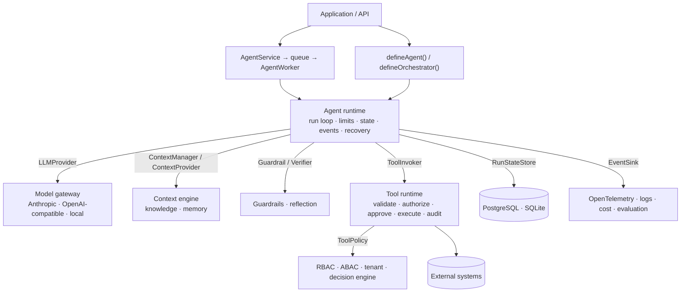

<div align="center">

# Agent Framework

**A deterministic runtime for enterprise AI agents in TypeScript.**

The model decides *what* to do. The framework decides *whether it may*, *how it runs*, and *what gets recorded*.

[](https://github.com/Abdelrahman-sadek/agents-framework/actions/workflows/ci.yml)
[](./LICENSE)
[](./tsconfig.base.json)
[](./package.json)
[](./docs/roadmap.md)

[Getting started](./docs/getting-started.md) ·
[Docs](./docs/README.md) ·
[Examples](./docs/examples/README.md) ·
[Architecture](./docs/architecture/README.md) ·
[Security](./docs/security.md) ·
[Roadmap](./docs/roadmap.md)

</div>

---

## Why

Most agent libraries make it easy to hand a model a list of functions. Enterprise agents need more than that:

- every tool call authorized against a real user and tenant;
- hard limits on steps and spend;
- approvals that survive a restart;
- retrieval that respects tenancy;
- memory that doesn't hoard secrets;
- telemetry that doesn't leak prompts;
- an evaluation suite that catches regressions.

Teams end up rebuilding that infrastructure for every agent.

Agent Framework is that infrastructure: a set of small, provider-independent TypeScript packages.

- **The LLM is a component, not the authority.** Authorization, limits, retries, state, persistence and audit are enforced by deterministic code. A model can *request* a tool; it can never grant itself permission to run one.
- **No vendor lock-in.** Models, vector stores, embedders, databases, queues, telemetry and policies sit behind interfaces. The core has zero runtime dependencies; vendor SDKs live only in adapter packages.
- **Explicit state.** A run is a serializable record of messages, steps, usage, context provenance and pending approvals. Runs pause for humans, survive crashes and resume on another worker.
- **Simple on the surface.** `defineTool`, `defineAgent`, `agent.run`. Everything else is opt-in.

## Quick look

```ts
import { citationVerifier, createRuntime, defineAgent } from "@agent-framework/core";
import { createKnowledgeBase, hashingEmbedder } from "@agent-framework/knowledge";
import { models } from "@agent-framework/llm";
import { anthropicProvider } from "@agent-framework/provider-anthropic";
import { piiGuardrail, promptInjectionGuardrail } from "@agent-framework/security";
import { ToolRuntime, defineTool } from "@agent-framework/tools";
import { z } from "zod";

const refund = defineTool({
  name: "issue_refund",
  description: "Refund an order",
  input: z.object({ orderId: z.string(), amount: z.number().positive() }),
  permissions: ["payments.refund"],                         // checked against agent AND user
  approval: { required: ({ amount }) => amount > 100 },     // human in the loop above 100
  idempotency: { key: ({ orderId }) => orderId },           // never pay twice
  retry: { maxAttempts: 3, backoff: "exponential" },
  execute: async ({ orderId, amount }) => payments.refund(orderId, amount),
});

const policies = createKnowledgeBase({ name: "policies", embedder: hashingEmbedder() });
await policies.ingest(policyDocuments);

const agent = defineAgent({
  name: "support-agent",
  model: models.anthropic("claude-opus-5"),
  instructions: "Resolve customer requests. Cite policy as [n].",
  tools: [refund],
  permissions: ["payments.*"],
  context: [policies.asContextProvider({ k: 3 })],                     // RAG with provenance
  guardrails: [piiGuardrail(), promptInjectionGuardrail()],            // input, tool results, output
  reflection: { verifiers: [citationVerifier()] },                     // generate → verify → correct
  limits: { maxSteps: 8, maxToolCalls: 5, maxCost: 0.25, timeoutMs: 60_000 },
  runtime: createRuntime({ providers: [anthropicProvider()], tools: new ToolRuntime() }),
});

const result = await agent.run({
  input: "Refund order 77, it arrived broken.",
  user: { userId: "u-42", tenantId: "acme", permissions: ["payments.refund"] },
});

if (result.status === "WAITING_FOR_APPROVAL") {
  // …later, in another request or process:
  await agent.resume({ runId: result.runId, approvals: [{ approvalId: result.pendingApprovals[0]!.approvalId, decision: "approved" }] });
}
```

Every tool call goes through the same deterministic pipeline, and every stage emits a typed event:

```
model requests tool ─▶ parse ─▶ validate ─▶ authorize ─▶ approval ─▶ rate limit ─▶ idempotency
                    ─▶ concurrency ─▶ execute (timeout · retry) ─▶ validate output ─▶ audit ─▶ tool-result guardrails
```

## Features

| Area | What you get | Package |
| --- | --- | --- |
| **Runtime** | Agent definition, run loop, explicit state, typed events, error model, limits (steps, tool calls, tokens, cost, time), cancellation, resume, crash recovery | `core` |
| **Models** | Provider contract with capability metadata; Anthropic (official SDK) and OpenAI-compatible adapters (OpenAI, OpenRouter, vLLM, Ollama); circuit breaker, rate limit, fallback | `llm`, `provider-anthropic` |
| **Tools** | Zod schemas, deterministic authorization, argument-bound human approval, timeouts, retries, rate limits, idempotency, concurrency, audit, HTTP tools with SSRF protection | `tools`, `security` |
| **Structured output** | JSON Schema response format, validation, correction loop | `core` |
| **Context** | Token budgets, ranked context items with provenance, truncation, summarization | `context` |
| **Knowledge / RAG** | Chunking, embeddings, vector + BM25 + hybrid search, reranking, metadata filters, tenant scoping, citations | `knowledge` |
| **Memory** | Conversation, user, entity, episodic and semantic memory with write policies, ownership, TTL, forget | `memory` |
| **Planning & orchestration** | Validated DAG plans, model or static planners, parallel workers, retries, re-planning | `orchestration` |
| **Reflection** | Rule, citation, LLM-critic and cross-agent verifiers with bounded correction | `core`, `orchestration` |
| **Multi-agent** | Supervisor, delegation with depth limits, pipeline, parallel | `orchestration` |
| **Security** | Guardrails (PII, prompt injection, secrets, content), RBAC, ABAC, tenant isolation, data classification, egress control, secrets, identity | `security` |
| **Observability** | OpenTelemetry spans and metrics, redaction, structured logs, cost tracking, run inspection | `observability` |
| **Evaluation** | Golden datasets, 12 evaluators including LLM judge, thresholds, regression comparison | `evaluation` |
| **Production** | PostgreSQL/SQLite state, durable queues with leases, workers with recovery, service API, health checks, config validation | `production` |
| **Developer experience** | `agent create / dev / test / evaluate / inspect / trace / validate`, JSON agent manifests, offline test models | `cli`, `core/testing` |

## Getting started

The packages are not published to npm yet ([naming is an open decision](./docs/decisions/014-package-identity.md)). Work from source:

```bash
git clone https://github.com/Abdelrahman-sadek/agents-framework.git
cd agents-framework
corepack enable        # pnpm 10
pnpm install
pnpm check             # typecheck + lint + tests
pnpm examples          # run all six examples offline
```

Requires Node.js ≥ 20.3 (≥ 22.5 for the SQLite adapters). All examples run offline with deterministic stand-in models, so no API key is needed. Set `ANTHROPIC_API_KEY` and swap in `anthropicProvider()` to use Claude.

Next: **[Getting started guide →](./docs/getting-started.md)**

## Architecture



The runtime only talks to ports, so everything at the end of an arrow is replaceable. See the [architecture overview](./docs/architecture/README.md) and the [core runtime](./docs/architecture/core-runtime.md).

## Packages

| Package | Description | Guide |
| --- | --- | --- |
| [`@agent-framework/core`](./packages/core) | Agents, runtime, state, events, errors, limits, ports, reflection and guardrail hooks | [agents](./docs/agents.md) |
| [`@agent-framework/tools`](./packages/tools) | `defineTool`, `ToolRuntime`, policies, audit | [tools](./docs/tools.md) |
| [`@agent-framework/llm`](./packages/llm) | Model selectors, OpenAI-compatible adapter, gateway wrappers | [models](./docs/models.md) |
| [`@agent-framework/provider-anthropic`](./packages/provider-anthropic) | Claude via the official Anthropic SDK | [models](./docs/models.md) |
| [`@agent-framework/context`](./packages/context) | Context engine | [context](./docs/context.md) |
| [`@agent-framework/knowledge`](./packages/knowledge) | Knowledge bases and retrieval | [knowledge](./docs/knowledge.md) |
| [`@agent-framework/memory`](./packages/memory) | Policy-driven memory | [memory](./docs/memory.md) |
| [`@agent-framework/orchestration`](./packages/orchestration) | Planning, orchestration, multi-agent | [orchestration](./docs/orchestration.md) |
| [`@agent-framework/security`](./packages/security) | Guardrails, policies, egress, secrets | [security](./docs/security.md) |
| [`@agent-framework/observability`](./packages/observability) | OpenTelemetry, logs, cost, inspection | [observability](./docs/observability.md) |
| [`@agent-framework/evaluation`](./packages/evaluation) | Datasets, evaluators, reports | [evaluation](./docs/evaluation.md) |
| [`@agent-framework/production`](./packages/production) | Durable state, queues, workers, service | [production](./docs/production.md) |
| [`@agent-framework/cli`](./packages/cli) | `agent` CLI and manifests | [cli](./docs/cli.md) |

## Examples

| Example | Shows |
| --- | --- |
| [`hello-agent`](./examples/hello-agent) | User → Agent → Tool → Answer, events and audit |
| [`research-agent`](./examples/research-agent) | Model-proposed plan, search tool, typed report, verification |
| [`rag-agent`](./examples/rag-agent) | Hybrid retrieval, tenant scoping, PII redaction, verified citations |
| [`orchestrator`](./examples/orchestrator) | Parallel research and data workers, verification worker |
| [`approval-agent`](./examples/approval-agent) | Approval predicate, pause, resume, idempotent side effects |
| [`enterprise-agent`](./examples/enterprise-agent) | Everything combined: planning, tools, RAG, memory, workers, reflection, guardrails, RBAC, cost tracking, evaluation |

## Documentation

- **Guides:** [Getting started](./docs/getting-started.md) · [Agents](./docs/agents.md) · [Tools](./docs/tools.md) · [Models](./docs/models.md) · [Context](./docs/context.md) · [Knowledge](./docs/knowledge.md) · [Memory](./docs/memory.md) · [Planning](./docs/planning.md) · [Reflection](./docs/reflection.md) · [Orchestration](./docs/orchestration.md) · [Multi-agent](./docs/multi-agent.md) · [Security](./docs/security.md) · [Guardrails](./docs/guardrails.md) · [Observability](./docs/observability.md) · [Evaluation](./docs/evaluation.md) · [Production](./docs/production.md) · [CLI](./docs/cli.md) · [Troubleshooting](./docs/troubleshooting.md)
- **Architecture:** [Overview](./docs/architecture/README.md) · [Core runtime](./docs/architecture/core-runtime.md) · [Public API](./docs/architecture/public-api.md) · [Events](./docs/architecture/events.md) · [Errors](./docs/architecture/errors.md) · [Configuration](./docs/architecture/configuration.md) · [Extension points](./docs/architecture/extension-points.md)
- **Security:** [Model and controls](./docs/security/README.md) · [Threat model](./docs/security/threat-model.md)
- **Decisions:** [ADRs](./docs/decisions/README.md) · [Open questions](./docs/decisions/open-questions.md)

## Roadmap

All 14 phases of the original plan are implemented: architecture, core runtime, tools, structured outputs, context, knowledge, memory, planning, reflection, orchestration, multi-agent, security, observability, evaluation and production. Next up: streaming through the run loop, pgvector and Redis adapters, MCP and sandbox tools, skills, a model router and a run-inspection dashboard. See [docs/roadmap.md](./docs/roadmap.md).

## Contributing

Contributions are welcome. Read [CONTRIBUTING.md](./CONTRIBUTING.md) first. Changes to core contracts or the public API need an [ADR](./docs/decisions/README.md).

## Security

Please report vulnerabilities privately as described in [SECURITY.md](./SECURITY.md).

## License

[Apache-2.0](./LICENSE)
