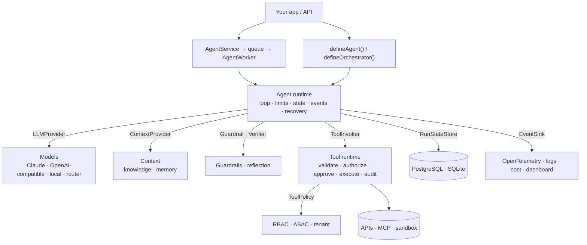

<div align="center">

# Agent Framework

**Build production AI agents in TypeScript: safe tool calling, RAG, memory, multi-agent orchestration, guardrails, human approval, observability and evaluation. Provider-independent.**

[](https://github.com/agent-farmework/agents-framework/actions/workflows/ci.yml)
[](./LICENSE)
[](./tsconfig.base.json)
[](./package.json)
[](#development)
[](./docs/roadmap.md)

[**Quickstart**](#quickstart) ·
[**Find what you need**](#find-what-you-need) ·
[**Examples**](#examples) ·
[**Docs**](./docs/README.md) ·
[**FAQ**](#faq)

</div>

---

## In 30 seconds

- **What it is:** a TypeScript/Node.js framework and runtime for building AI agents that are safe to run in production: agents that call tools, retrieve documents, remember users, plan, verify their answers, and wait for human approval.
- **What makes it different:** the model *requests* actions; **deterministic code decides** whether they are allowed, runs them under limits, and records what happened. Permissions, budgets, retries, approvals and audit never depend on what the model says.
- **Who it's for:** teams building agents for real users and real data, in multi-tenant, regulated or cost-sensitive settings, who want one foundation instead of re-building the same infrastructure for every agent.
- **Works with:** Anthropic Claude, OpenAI, OpenRouter, Gemini (OpenAI-compatible endpoint), vLLM, Ollama, LM Studio, and any MCP server. PostgreSQL, pgvector, SQLite, Redis and OpenTelemetry through adapters.

```ts
const agent = defineAgent({
  name: "support",
  model: models.anthropic("claude-opus-5"),
  instructions: "Resolve customer requests.",
  tools: [lookupOrder, issueRefund],          // validated, permission-checked, audited
  limits: { maxSteps: 8, maxCost: 0.25 },     // hard limits, enforced by the runtime
  runtime,
});

const result = await agent.run({ input: "Refund order 77", user });
// result.status: COMPLETED | WAITING_FOR_APPROVAL | FAILED | …
```

## Table of contents

- [Find what you need](#find-what-you-need)
- [Quickstart](#quickstart)
- [Core concepts](#core-concepts)
- [Features](#features)
- [Packages](#packages)
- [Examples](#examples)
- [Architecture](#architecture)
- [When to use it](#when-to-use-it)
- [FAQ](#faq)
- [Repository map](#repository-map)
- [Development](#development)
- [Status and roadmap](#status-and-roadmap)
- [Contributing, security, license](#contributing)

## Find what you need

| I want to… | Use | Package | Guide |
| --- | --- | --- | --- |
| Build my first agent | `defineAgent`, `createRuntime` | `core` | [Getting started](./docs/getting-started.md) |
| Give an agent tools (functions) | `defineTool`, `ToolRuntime` | `tools` | [Tools](./docs/tools.md) |
| Control who may call which tool | `permissionPolicy`, `rbacPolicy`, `abacPolicy` | `tools`, `security` | [Security](./docs/security.md) |
| Require human approval for risky actions | `approval: { required }`, `agent.resume()` | `tools`, `core` | [Agents › Human approval](./docs/agents.md#human-approval) |
| Use Claude, OpenAI or a local model | `anthropicProvider`, `openAICompatibleProvider` | `provider-anthropic`, `llm` | [Models](./docs/models.md) |
| Pick a model automatically by cost or capability | `createModelRouter` | `llm` | [Models › Router](./docs/models.md#model-router) |
| Stream tokens to a UI | `agent.stream()` | `core` | [Agents › Streaming](./docs/agents.md#streaming) |
| Get typed JSON output | `output: zodSchema` | `core` | [Agents › Structured output](./docs/agents.md#structured-output) |
| Answer from documents with citations (RAG) | `createKnowledgeBase` | `knowledge` | [Knowledge](./docs/knowledge.md) |
| Remember users and conversations | `createMemory` | `memory` | [Memory](./docs/memory.md) |
| Keep prompts within the context window | `createContextEngine` | `context` | [Context](./docs/context.md) |
| Check answers before returning them | `citationVerifier`, `llmCritic`, `ruleVerifier` | `core` | [Reflection](./docs/reflection.md) |
| Split work across several agents | `defineOrchestrator`, `supervisor` | `orchestration` | [Orchestration](./docs/orchestration.md), [Multi-agent](./docs/multi-agent.md) |
| Block PII, prompt injection or leaked secrets | `piiGuardrail`, `promptInjectionGuardrail` | `security` | [Guardrails](./docs/guardrails.md) |
| Call external APIs safely (SSRF protection) | `defineHttpTool`, `createEgressPolicy` | `security` | [Security › Egress](./docs/security.md#egress-and-ssrf) |
| Use tools from an MCP server | `mcpTools` | `mcp` | [MCP](./docs/mcp.md) |
| Let an agent read/write files or run commands safely | `workspaceTools`, `commandTool` | `sandbox` | [Sandbox](./docs/sandbox.md) |
| Package reusable capabilities | `defineSkill` | `core` | [Skills](./docs/skills.md) |
| Trace runs, track cost, see a dashboard | `openTelemetrySink`, `CostTracker`, `agent dashboard` | `observability` | [Observability](./docs/observability.md) |
| Test agent quality and catch regressions | `defineEvaluation`, `evaluators` | `evaluation` | [Evaluation](./docs/evaluation.md) |
| Run agents as a durable service | `AgentService`, `AgentWorker`, PostgreSQL stores | `production` | [Production](./docs/production.md) |
| Scaffold, run and debug from the terminal | `agent create / dev / trace` | `cli` | [CLI](./docs/cli.md) |
| Understand a failure | error codes, run inspection | — | [Troubleshooting](./docs/troubleshooting.md) |

## Quickstart

Requires **Node.js ≥ 20.3** (≥ 22.5 for the SQLite adapters).

**Install as a dependency** (packages are published to [GitHub Packages](https://docs.github.com/packages/working-with-a-github-packages-registry/working-with-the-npm-registry)):

```bash
# .npmrc in your project. GitHub Packages needs a token with read:packages, even for public packages
@agent-farmework:registry=https://npm.pkg.github.com
//npm.pkg.github.com/:_authToken=${GITHUB_TOKEN}
```

```bash
npm install @agent-farmework/core @agent-farmework/tools @agent-farmework/llm zod
```

**Or run from source** (pnpm 10 via Corepack):

```bash
git clone https://github.com/agent-farmework/agents-framework.git
cd agents-framework
corepack enable
pnpm install
pnpm examples          # runs all six examples offline, no API key needed
```

A complete agent with one tool:

```ts
import { createRuntime, defineAgent } from "@agent-farmework/core";
import { models } from "@agent-farmework/llm";
import { anthropicProvider } from "@agent-farmework/provider-anthropic";
import { ToolRuntime, defineTool } from "@agent-farmework/tools";
import { z } from "zod";

const getWeather = defineTool({
  name: "get_weather",
  description: "Current weather for a city",
  input: z.object({ city: z.string() }),
  permissions: ["weather.read"],
  execute: async ({ city }) => ({ city, temperatureC: 21 }),
});

const runtime = createRuntime({
  providers: [anthropicProvider()],   // reads ANTHROPIC_API_KEY
  tools: new ToolRuntime(),           // the only path from model to execute()
});

const agent = defineAgent({
  name: "weather-assistant",
  model: models.anthropic("claude-opus-5"),
  instructions: "Answer weather questions using the tool.",
  tools: [getWeather],
  permissions: ["weather.read"],
  runtime,
});

const result = await agent.run({
  input: "What's the weather in Cairo?",
  user: { userId: "u-1", tenantId: "acme", permissions: ["weather.read"] },
});
console.log(result.status, result.output);
```

To use a local model instead, set `providers: [openAICompatibleProvider({ id: "ollama", baseURL: "http://localhost:11434/v1" })]` and `model: models.local("ollama", "llama3.1:8b")`.

Next: the [getting started guide](./docs/getting-started.md), or copy an [example](#examples).

## Core concepts

| Concept | One line |
| --- | --- |
| **Agent** | A model, instructions, tools, permissions and limits (`defineAgent`). A definition, not a process. |
| **Runtime** | Runs agents: the model/tool loop, limits, retries, state, events (`createRuntime`). No globals. |
| **Tool** | A typed function the model may *request* (`defineTool`). Executed only by the `ToolRuntime`. |
| **Run** | One execution with explicit, serializable state. Ends in a status, never a thrown error. |
| **Principal** | The user an agent acts for (id, tenant, roles, permissions). Every authorization uses it. |
| **Approval** | A paused tool call awaiting a human: approve, modify, reject or escalate, then `resume()`. |
| **Context provider** | Contributes knowledge or memory to a run, with provenance for citations. |
| **Guardrail / Verifier** | Deterministic checks on input, tool results and output; checks on the final answer. |
| **Event** | A typed, sequenced record of everything that happened; feeds tracing, logs, cost and audit. |
| **Port / adapter** | Interfaces (`LLMProvider`, `RunStateStore`, `VectorStore`…) and their swappable implementations. |

## Features

| Area | Highlights |
| --- | --- |
| **Runtime** | Run loop with limits on steps, tool calls, tokens, cost and time; cancellation; streaming; resume; crash recovery |
| **Tools** | Zod schemas; deterministic authorization (agent **and** user permissions); approval bound to exact arguments; timeout, retry, rate limit, idempotency, concurrency; audit log |
| **Models** | Anthropic (official SDK), OpenAI-compatible (OpenAI, OpenRouter, Gemini, vLLM, Ollama); streaming; model router; circuit breaker, rate limit, fallback |
| **Structured output** | JSON Schema response format, validation, automatic correction |
| **Knowledge / RAG** | Chunking, embeddings, vector + BM25 + hybrid search, reranking, metadata filters, tenant scoping, citations |
| **Memory** | Conversation, user, entity, episodic and semantic memory; write policies; ownership; TTL; forget |
| **Context** | Token budgets, ranked items, truncation, summarization |
| **Planning & multi-agent** | Validated plans, parallel workers, re-planning, supervisor, delegation with depth limits, pipeline, parallel |
| **Reflection** | Rule, citation, LLM-critic and cross-agent verifiers with bounded revision |
| **Security** | PII / prompt-injection / secret-leak guardrails; RBAC, ABAC, tenant isolation, data classification; SSRF-safe HTTP; secrets |
| **Integrations** | MCP servers as tools; sandboxed workspace files and allow-listed commands; skills |
| **Observability** | OpenTelemetry spans and metrics, redacted logs, cost by tenant/user/model, run inspection, local dashboard |
| **Evaluation** | Datasets, 12 evaluators including LLM-as-judge, thresholds, regression comparison, CI-friendly CLI |
| **Production** | PostgreSQL / SQLite / pgvector / Redis adapters, durable queues, workers with recovery, service API, health checks |

## Packages

All packages live in [`packages/`](./packages) and are published under the `@agent-farmework/*` working scope.

| Package | What it does | Guide |
| --- | --- | --- |
| [`core`](./packages/core) | Agents, runtime, state, events, errors, limits, skills, reflection and guardrail hooks. Zero dependencies | [agents](./docs/agents.md) |
| [`tools`](./packages/tools) | `defineTool`, `ToolRuntime`, policies, approvals, audit | [tools](./docs/tools.md) |
| [`llm`](./packages/llm) | Model selectors, OpenAI-compatible adapter, router, gateway wrappers | [models](./docs/models.md) |
| [`provider-anthropic`](./packages/provider-anthropic) | Claude via the official Anthropic SDK | [models](./docs/models.md) |
| [`context`](./packages/context) | Context engine | [context](./docs/context.md) |
| [`knowledge`](./packages/knowledge) | Knowledge bases, retrieval, citations | [knowledge](./docs/knowledge.md) |
| [`memory`](./packages/memory) | Policy-driven memory | [memory](./docs/memory.md) |
| [`orchestration`](./packages/orchestration) | Planning, orchestration, multi-agent | [orchestration](./docs/orchestration.md) |
| [`security`](./packages/security) | Guardrails, policies, egress control, secrets | [security](./docs/security.md) |
| [`mcp`](./packages/mcp) | MCP servers as framework tools | [mcp](./docs/mcp.md) |
| [`sandbox`](./packages/sandbox) | Workspace file tools and safe command execution | [sandbox](./docs/sandbox.md) |
| [`observability`](./packages/observability) | OpenTelemetry, logs, cost, inspection, dashboard | [observability](./docs/observability.md) |
| [`evaluation`](./packages/evaluation) | Datasets, evaluators, reports | [evaluation](./docs/evaluation.md) |
| [`production`](./packages/production) | Durable state, queues, workers, service, stores | [production](./docs/production.md) |
| [`cli`](./packages/cli) | `agent` command and agent manifests | [cli](./docs/cli.md) |

## Examples

Every example runs offline with a deterministic stand-in model: `pnpm example:<name>`.

| Example | Pattern | Run |
| --- | --- | --- |
| [hello-agent](./examples/hello-agent) | User → agent → tool → answer, with events and audit | `pnpm example:hello` |
| [research-agent](./examples/research-agent) | Plan → search → analyze → verify → typed report | `pnpm example:research` |
| [rag-agent](./examples/rag-agent) | Retrieval with tenant scoping, PII redaction, verified citations | `pnpm example:rag` |
| [orchestrator](./examples/orchestrator) | Parallel research and data workers, verification worker | `pnpm example:orchestrator` |
| [approval-agent](./examples/approval-agent) | Human approval: pause → approve → resume, idempotent refund | `pnpm example:approval` |
| [enterprise-agent](./examples/enterprise-agent) | Everything combined, including RBAC, memory, cost tracking and evaluation | `pnpm example:enterprise` |

## Architecture



Every tool call follows the same deterministic pipeline:

```
model requests tool → parse → validate → authorize → approval → rate limit → idempotency
                    → execute (timeout · retry) → validate output → audit → tool-result guardrails → model
```

Deep dive: [architecture overview](./docs/architecture/README.md) · [core runtime](./docs/architecture/core-runtime.md) · [events](./docs/architecture/events.md) · [errors](./docs/architecture/errors.md) · [decisions (ADRs)](./docs/decisions/README.md).

## When to use it

**A good fit when you need:**

- agents acting on behalf of real users, with per-user and per-tenant permissions;
- actions with consequences (payments, data changes, emails) that need approvals, idempotency and an audit trail;
- budgets and limits you can prove are enforced;
- freedom to switch between model vendors or run models locally;
- durable runs that survive restarts and wait days for a human.

**Probably overkill when:**

- you need a single prompt → completion call (use a provider SDK directly);
- you are prototyping a chat UI and want the fewest lines possible;
- you need a hosted, no-code agent builder.

## FAQ

<details>
<summary><b>Which LLMs does it support?</b></summary>

Claude through `@agent-farmework/provider-anthropic` (official SDK; Bedrock, Vertex and Foundry clients can be injected). OpenAI, OpenRouter, Gemini's OpenAI-compatible endpoint, Azure OpenAI, vLLM, Ollama, LM Studio and llama.cpp server through `openAICompatibleProvider`. Any other model: implement the small `LLMProvider` interface. See [Models](./docs/models.md).
</details>

<details>
<summary><b>Can the model bypass permissions or approvals?</b></summary>

No. The model only produces a tool *request*. The `ToolRuntime` validates the arguments, checks the agent's and the user's permissions with deterministic policies (fail closed), requires approval where configured (bound to the exact arguments, with expiry), then executes and audits. Tools not registered on the agent can never run. See [Tools](./docs/tools.md) and the [threat model](./docs/security/threat-model.md).
</details>

<details>
<summary><b>How is this different from LangChain, the OpenAI Agents SDK or the Vercel AI SDK?</b></summary>

Those are excellent for building agents and AI features quickly. This framework focuses on the enterprise runtime concerns around them: deterministic authorization with user + agent + tenant identity, argument-bound approvals with durable pause/resume, hard budgets, multi-tenant RAG and memory, audit, crash recovery, and evaluation gates. All of it is provider-independent, with zero dependencies in the core. It is not a wrapper around another framework.
</details>

<details>
<summary><b>Does it work with MCP?</b></summary>

Yes. `mcpTools()` turns any MCP server's tools into framework tools, so they get local schema validation, permissions, approvals and audit like any other tool. See [MCP](./docs/mcp.md).
</details>

<details>
<summary><b>Is it production-ready?</b></summary>

The runtime, tools, security and production packages have extensive tests (281 across 15 packages), durable PostgreSQL/SQLite state, queues with leases, crash recovery and health checks. The project is **0.x**: APIs may still change in minor versions. Packages are published to GitHub Packages; npmjs.com comes later. See [Production](./docs/production.md) and the [roadmap](./docs/roadmap.md).
</details>

<details>
<summary><b>Can I run it without an API key or network?</b></summary>

Yes. All examples and tests use deterministic stand-in models (`createScriptedProvider`, `createRuleProvider` from `@agent-farmework/core/testing`), and `hashingEmbedder` provides local embeddings.
</details>

<details>
<summary><b>How do I see what an agent did and what it cost?</b></summary>

Every run emits typed events. Send them to OpenTelemetry (`openTelemetrySink`), logs (`logSink`), a cost report (`CostTracker`), or the local dashboard (`agent dashboard --events events.jsonl`). See [Observability](./docs/observability.md).
</details>

## Repository map

```text
packages/          15 packages (see Packages above); each has src/, tests next to sources, README.md
examples/          6 runnable examples (offline)
docs/              guides (one per subsystem), architecture/, decisions/ (ADRs), security/, roadmap.md
  README.md        documentation index
llms.txt           machine-readable index for AI assistants and agents
AGENTS.md          instructions for coding agents working in this repository
CHANGELOG.md       release notes
```

## Development

```bash
pnpm install
pnpm check               # typecheck + lint + all tests
pnpm test --project core # one package
pnpm examples            # run every example
pnpm build               # emit dist/ for all packages
```

Tests use Vitest and import sources directly, so no build step is needed. Details: [CONTRIBUTING.md](./CONTRIBUTING.md) and [AGENTS.md](./AGENTS.md).

## Status and roadmap

- ✅ All 14 planned phases, plus streaming, skills, model router, MCP, sandbox, dashboard, pgvector and Redis stores.
- 📦 Published to GitHub Packages under `@agent-farmework/*`.
- ⏭️ Next: mirror to npmjs.com, a container sandbox runner, a Temporal worker, a native Gemini adapter.

Details: [docs/roadmap.md](./docs/roadmap.md) · [CHANGELOG.md](./CHANGELOG.md).

## Contributing

Contributions are welcome. Read [CONTRIBUTING.md](./CONTRIBUTING.md). Changes to public contracts need an [ADR](./docs/decisions/README.md).

## Security

Please report vulnerabilities privately; see [SECURITY.md](./SECURITY.md).

## License

[Apache-2.0](./LICENSE)

<sub>Keywords: TypeScript AI agent framework, Node.js LLM agents, tool calling, function calling, RAG, retrieval-augmented generation, agent memory, multi-agent orchestration, human-in-the-loop approval, guardrails, prompt injection defense, MCP, Model Context Protocol, OpenTelemetry, LLM evaluation, Claude, Anthropic, OpenAI, Ollama, enterprise AI.</sub>
