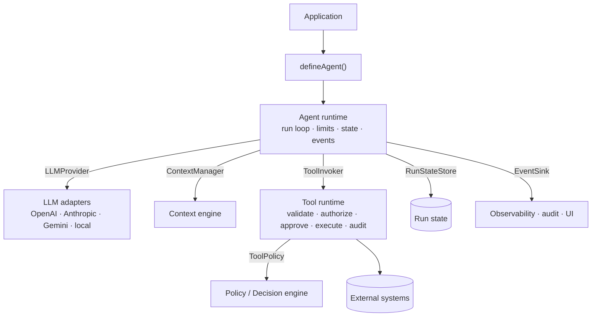

<div align="center">

# Agent Framework

**A deterministic runtime for enterprise AI agents in TypeScript.**

The model decides *what* to do. The framework decides *whether it may*, *how it runs*, and *what gets recorded*.

[](https://github.com/Abdelrahman-sadek/agents-framework/actions/workflows/ci.yml)
[](./LICENSE)
[](./tsconfig.base.json)
[](./package.json)
[-orange.svg)](./docs/roadmap.md)

[Getting started](./docs/getting-started.md) ·
[Agents](./docs/agents.md) ·
[Tools](./docs/tools.md) ·
[Architecture](./docs/architecture/README.md) ·
[Security](./docs/security/README.md) ·
[Roadmap](./docs/roadmap.md)

</div>

---

## Why

Most agent libraries make it easy to hand a model a list of functions. Enterprise agents need more than that: every tool call authorized against a real user and tenant, hard limits on steps and spend, approvals that survive a restart, and an audit trail that doesn't leak secrets. Teams end up rebuilding that infrastructure for every agent.

Agent Framework is that infrastructure, packaged as a small set of provider-independent TypeScript packages:

- **The LLM is a component, not the authority.** Authorization, limits, retries, state and audit are enforced by deterministic code. A model can *request* a tool; it can never grant itself permission to run one.
- **No vendor lock-in.** Models, persistence, events and policies sit behind interfaces. OpenAI, Anthropic, Gemini, OpenRouter and local models are adapters, as are PostgreSQL, Redis, Temporal, OpenTelemetry and MCP.
- **Explicit state.** A run is a serializable record of messages, steps, usage and pending approvals, never hidden inside a prompt. That's what lets runs pause for a human and resume later.
- **Simple on the surface.** `defineTool`, `defineAgent`, `agent.run`. The rest is opt-in.

## Quick look

```ts
import { createRuntime, defineAgent } from "@agent-framework/core";
import { models } from "@agent-framework/llm";
import { ToolRuntime, defineTool } from "@agent-framework/tools";
import { z } from "zod";

const refund = defineTool({
  name: "issue_refund",
  description: "Refund an order",
  input: z.object({ orderId: z.string(), amount: z.number().positive() }),
  permissions: ["payments.refund"],                         // checked against agent AND user
  approval: { required: ({ amount }) => amount > 100 },     // human in the loop above 100
  idempotency: { key: ({ orderId }) => orderId },           // never pay twice
  timeoutMs: 10_000,
  retry: { maxAttempts: 3, backoff: "exponential" },
  execute: async ({ orderId, amount }) => payments.refund(orderId, amount),
});

const runtime = createRuntime({
  providers: [anthropicProvider],                           // any LLMProvider adapter
  tools: new ToolRuntime(),                                 // the only path to execute()
});

const agent = defineAgent({
  name: "support-agent",
  model: models.anthropic("claude-sonnet-5"),
  instructions: "You help customers with their orders.",
  tools: [refund],
  permissions: ["payments.*"],
  limits: { maxSteps: 8, maxToolCalls: 5, maxCost: 0.25, timeoutMs: 60_000 },
  runtime,
});

const result = await agent.run({
  input: "Refund order 77, it arrived broken.",
  user: { userId: "u-42", tenantId: "acme", permissions: ["payments.refund"] },
});

if (result.status === "WAITING_FOR_APPROVAL") {
  // …later, after a reviewer decides:
  await agent.resume({ runId: result.runId, approvals: [{ approvalId: result.pendingApprovals[0]!.approvalId, decision: "approved" }] });
}
```

Every tool call goes through the same pipeline, and each stage emits a typed event:

```
model requests tool ─▶ parse ─▶ validate input ─▶ authorize ─▶ approval ─▶ rate limit
                    ─▶ idempotency ─▶ concurrency ─▶ execute (timeout · retry) ─▶ validate output ─▶ audit
```

## Features

| Capability | Status | Where |
| --- | :---: | --- |
| Agent definition, run loop, explicit serializable state | ✅ | `@agent-framework/core` |
| Typed event stream (sequenced, correlated, sink-isolated) | ✅ | `@agent-framework/core` |
| Error model (codes, categories, retryability, correlation) | ✅ | `@agent-framework/core` |
| Limits: steps, tool calls, tokens, cost, timeout, retries | ✅ | `@agent-framework/core` |
| Cancellation via `AbortSignal`, run timeouts | ✅ | `@agent-framework/core` |
| Provider-independent LLM contract with capability metadata | ✅ | `@agent-framework/core`, `@agent-framework/llm` |
| Tools: schema validation, deterministic authorization, audit | ✅ | `@agent-framework/tools` |
| Tools: timeout, retry/backoff, rate limit, idempotency, concurrency | ✅ | `@agent-framework/tools` |
| Human approval: pause → persist → resume, argument-bound, expiring | ✅ | `core` + `tools` |
| Structured output (parse + validate) | ✅ basic | `@agent-framework/core` (correction loop in Phase 3) |
| Decision engine extension point (rules, local models, judges) | ✅ interface | `@agent-framework/core` |
| Context engine, token budgeting, compression | 🧩 port | Phase 4 |
| Knowledge / RAG with citations | 🗓️ | Phase 5 |
| Memory (conversation, user, entity, episodic, semantic) | 🗓️ | Phase 6 |
| Planning, reflection, orchestration, multi-agent | 🗓️ | Phases 7–10 |
| Guardrails, RBAC/ABAC, tenant isolation, OpenTelemetry, evaluation | 🗓️ | Phases 11–13 |
| Durable execution (PostgreSQL / Redis / Temporal adapters) | 🧩 port | Phase 14 |

✅ implemented and tested · 🧩 interface in place, implementation planned · 🗓️ planned

## Getting started

The packages are not published to npm yet ([naming is an open decision](./docs/decisions/014-package-identity.md)). Work from source:

```bash
git clone https://github.com/Abdelrahman-sadek/agents-framework.git
cd agents-framework
corepack enable        # pnpm 10
pnpm install
pnpm check             # typecheck + lint + tests
pnpm example:hello     # agent → tool → answer
pnpm example:approval  # human-in-the-loop refund
```

Requires Node.js ≥ 20.3. Both examples run offline with a scripted model, so no API key is needed.

Next: **[Getting started guide →](./docs/getting-started.md)**

## Architecture



The runtime only talks to ports. Everything to the right of an arrow is replaceable. See the [architecture overview](./docs/architecture/README.md) and the [core runtime](./docs/architecture/core-runtime.md).

## Packages

| Package | Description |
| --- | --- |
| [`@agent-framework/core`](./packages/core) | Agent definition, runtime, state, events, errors, limits, and the provider/tool/context/decision/state ports |
| [`@agent-framework/tools`](./packages/tools) | `defineTool` and the `ToolRuntime`: validation, policy, approval, reliability, audit |
| [`@agent-framework/llm`](./packages/llm) | Vendor-free model selectors (`models.openai(…)`, `models.local(…)`) |
| `context`, `knowledge`, `memory`, `orchestration`, `security`, `observability`, `evaluation`, `cli` | Reserved, private packages for later phases ([ADR 016](./docs/decisions/016-package-boundaries.md)) |

## Examples

| Example | Shows |
| --- | --- |
| [`hello-agent`](./examples/hello-agent) | User → Agent → Tool → Answer, events and audit |
| [`approval-agent`](./examples/approval-agent) | Approval predicate, pause, resume, idempotent side effects |

More are planned per phase: research agent, RAG, orchestrator/workers, and a full enterprise agent ([docs/examples](./docs/examples/README.md)).

## Documentation

- **Guides:** [Getting started](./docs/getting-started.md) · [Agents](./docs/agents.md) · [Tools](./docs/tools.md) · [Troubleshooting](./docs/troubleshooting.md)
- **Architecture:** [Overview](./docs/architecture/README.md) · [Core runtime](./docs/architecture/core-runtime.md) · [Public API](./docs/architecture/public-api.md) · [Events](./docs/architecture/events.md) · [Errors](./docs/architecture/errors.md) · [Configuration](./docs/architecture/configuration.md) · [Extension points](./docs/architecture/extension-points.md)
- **Security:** [Model and controls](./docs/security/README.md) · [Threat model](./docs/security/threat-model.md)
- **Decisions:** [ADRs](./docs/decisions/README.md) · [Open questions](./docs/decisions/open-questions.md)
- **Everything:** [docs index](./docs/README.md)

## Roadmap

The framework is built one phase at a time, and each phase must pass typecheck, lint, tests, security review, docs and an example before the next one starts.

| Phase | Scope | Status |
| --- | --- | --- |
| 0 | Architecture, ADRs, threat model, API proposal | ✅ Done |
| 1 | Core runtime: agents, state, events, errors, LLM contract, limits | ✅ Done |
| 2 | Tool system | ✅ Done |
| 3 | Structured outputs: correction loop, JSON Schema responses | ⏭️ Next |
| 4–6 | Context engine · Knowledge/RAG · Memory | 🗓️ |
| 7–10 | Planning · Reflection · Orchestration · Multi-agent | 🗓️ |
| 11–14 | Security · Observability · Evaluation · Production | 🗓️ |

Details: [docs/roadmap.md](./docs/roadmap.md).

## Contributing

Contributions are welcome. Read [CONTRIBUTING.md](./CONTRIBUTING.md) first. Changes to core contracts or the public API need an [ADR](./docs/decisions/README.md).

## Security

Please report vulnerabilities privately as described in [SECURITY.md](./SECURITY.md).

## License

[Apache-2.0](./LICENSE)
